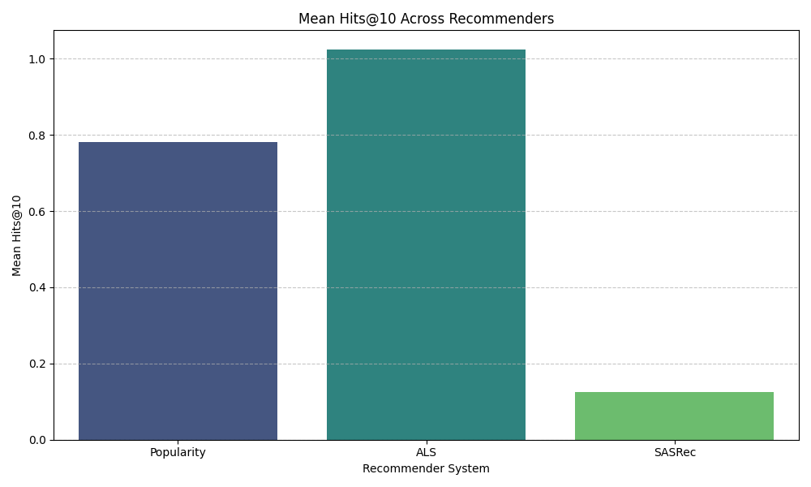
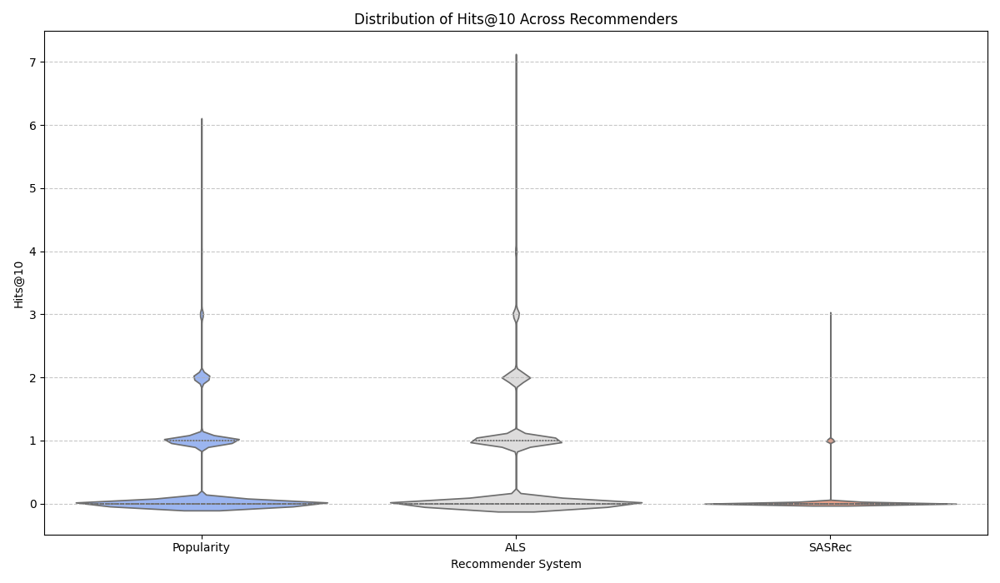

# Recommendation System A/B Testing and Evaluation

This notebook performs A/B testing and evaluation of different recommendation systems: a Popularity-based Baseline, an Alternating Least Squares (ALS) model, and a SASRec (Self-Attentive Sequential Recommendation) model. The evaluation focuses on key metrics such as Hits@10, Revenue from Hits, and Basket Coverage, using paired Wilcoxon signed-rank tests for statistical significance.

## Executive Summary of A/B Test Results

**ALS vs. Popularity-based Baseline:**
*   **Hits@10:** ALS (Mean: 1.02) significantly outperforms Popularity (Mean: 0.78).
*   **Revenue from Hits:** ALS (Mean: 1.02) significantly outperforms Popularity (Mean: 0.78).
*   **Basket Coverage:** ALS (Mean: 0.22) significantly outperforms Popularity (Mean: 0.16).

**SASRec vs. Popularity-based Baseline:**
*   **Hits@10:** Popularity (Mean: 1.13) significantly outperforms SASRec (Mean: 0.12).
*   **Revenue from Hits:** Popularity (Mean: 1.13) significantly outperforms SASRec (Mean: 0.12).
*   **Basket Coverage:** Popularity (Mean: 0.24) significantly outperforms SASRec (Mean: 0.07).

**ALS vs. SASRec:**
*   **Hits@10:** ALS (Mean: 1.25) significantly outperforms SASRec (Mean: 0.11).
*   **Revenue from Hits:** ALS (Mean: 1.25) significantly outperforms SASRec (Mean: 0.11).
*   **Basket Coverage:** ALS (Mean: 0.27) significantly outperforms SASRec (Mean: 0.06).

Additionally, the project integrates simulated consumer metrics like Churn Rate and Customer Lifetime Value (CLTV) to provide a more holistic business perspective.

## Key Visualizations

These plots provide a concise overview of the performance comparison across all three recommender systems (Popularity-based Baseline, ALS, and SASRec) for key metrics.

### Mean Hits@10 Across Recommenders

*This bar chart compares the average Hits@10 achieved by each recommendation system.* 

### Hits@10 Distribution Across Recommenders

*This violin plot illustrates the distribution of Hits@10 values for each recommendation system, providing insight into consistency and range of performance.*

### Mean Revenue from Hits Across Recommenders

*This bar chart compares the average 'Revenue from Hits' generated by each recommendation system, indicating their effectiveness in recommending reordered items.* 

## Overall Consumer Behavior Metrics (Simulated)

These metrics provide a high-level view of customer behavior. In a real-world scenario, these would be directly calculated from granular transaction data. Here, they are simulated for demonstration purposes.

### Churn Metrics

-   **Overall Churn Rate:** 34.62%
-   **Number of Churned Users (Simulated):** 70292
-   *(Based on a simulated 203026 users)*

### Customer Lifetime Value (CLTV) Metrics

-   **Overall Average CLTV:** $654.66
-   **CLTV Standard Deviation:** $211.89
-   *(Based on a simulated 203026 users)*

**Note on Consumer Metrics:** For a true assessment of recommender system impact on churn and CLTV, a long-running A/B test is required where different user groups are exposed to different recommendation strategies, and their subsequent long-term behavior (churn, purchases leading to CLTV) is tracked.
