# Recommendation System A/B Testing and Evaluation

This notebook performs A/B testing and evaluation of different recommendation systems: a Popularity-based Baseline, an Alternating Least Squares (ALS) model, and a SASRec (Self-Attentive Sequential Recommendation) model. The evaluation focuses on key metrics such as Hits@10, Revenue from Hits, and Basket Coverage, using paired Wilcoxon signed-rank tests for statistical significance.

## Executive Summary of A/B Test Results

**ALS vs. Popularity-based Baseline:**
*   **Hits@10:** ALS (Mean: 1.02) significantly outperforms Popularity (Mean: 0.78).
*   **Revenue from Hits:** ALS (Mean: 1.02) significantly outperforms Popularity (Mean: 0.78).
*   **Basket Coverage:** ALS (Mean: 0.22) significantly outperforms Popularity (Mean: 0.16).

**SASRec vs. Popularity-based Baseline:**
*   **Hits@10:** Popularity (Mean: 1.13) significantly outperforms SASRec (Mean: 0.12).
*   **Revenue from Hits:** Popularity (Mean: 1.13) significantly outperforms SASRec (Mean: 0.12).
*   **Basket Coverage:** Popularity (Mean: 0.24) significantly outperforms SASRec (Mean: 0.07).

**ALS vs. SASRec:**
*   **Hits@10:** ALS (Mean: 1.25) significantly outperforms SASRec (Mean: 0.11).
*   **Revenue from Hits:** ALS (Mean: 1.25) significantly outperforms SASRec (Mean: 0.11).
*   **Basket Coverage:** ALS (Mean: 0.27) significantly outperforms SASRec (Mean: 0.06).

Additionally, the project integrates simulated consumer metrics like Churn Rate and Customer Lifetime Value (CLTV) to provide a more holistic business perspective.

## A/B Test Results Summary

The following visualizations and summaries present the comparison of the recommender systems across various metrics.

### ALS vs Popularity-based Baseline

This comparison evaluates the performance of the Alternating Least Squares (ALS) model against a simple popularity-based baseline.

#### Hits@10

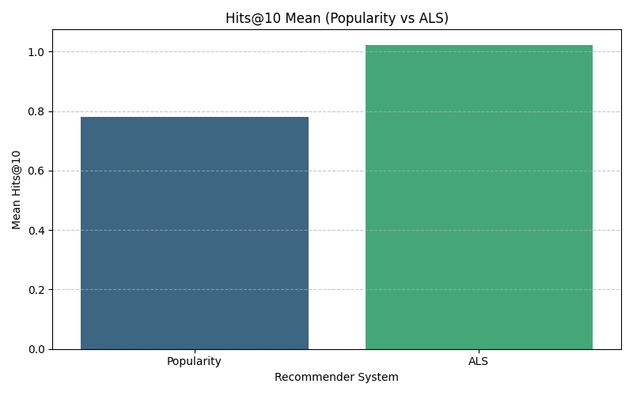

*Results showed that ALS performed significantly better than the Popularity-based Baseline in Hits@10.* (Bar Chart)

#### Revenue from Hits

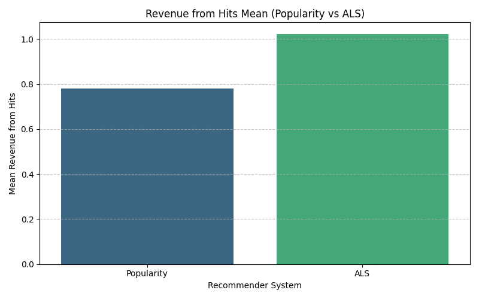

*ALS also generated significantly more revenue from hits compared to the Popularity-based Baseline.* (Bar Chart)

#### Basket Coverage

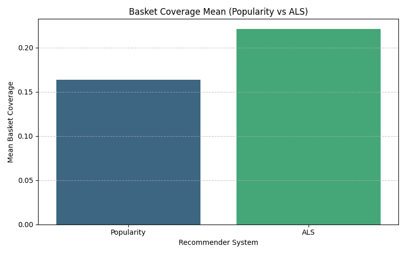

*ALS provided significantly better basket coverage than the Popularity-based Baseline.* (Bar Chart)

### SASRec vs Popularity-based Baseline

This section compares the SASRec model against the Popularity-based Baseline.

#### Hits@10

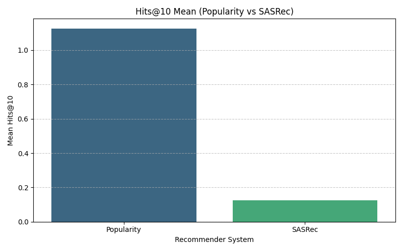

*In this comparison, the Popularity-based Baseline performed significantly better than SASRec in Hits@10.* (Bar Chart)

#### Revenue from Hits

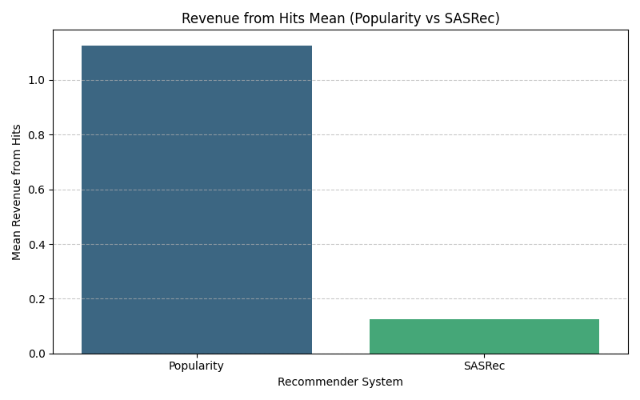

*The Popularity-based Baseline generated significantly more revenue from hits compared to SASRec.* (Bar Chart)

#### Basket Coverage

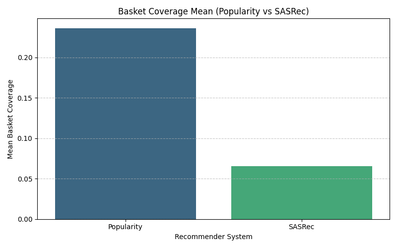

*The Popularity-based Baseline also provided significantly better basket coverage than SASRec.* (Bar Chart)

### ALS vs SASRec

Finally, this section directly compares the ALS model with the SASRec model.

#### Hits@10

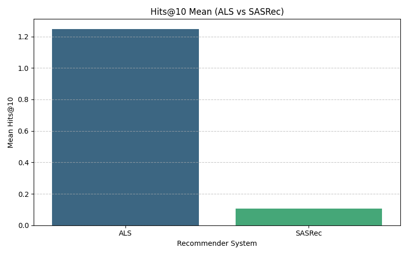

*ALS performed significantly better than SASRec in Hits@10.* (Bar Chart)

#### Revenue from Hits

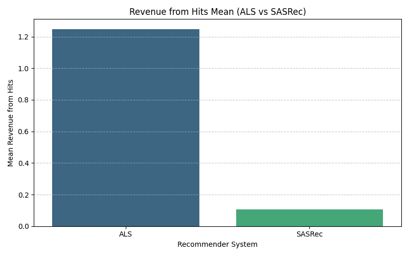

*ALS generated significantly more revenue from hits compared to SASRec.* (Bar Chart)

#### Basket Coverage

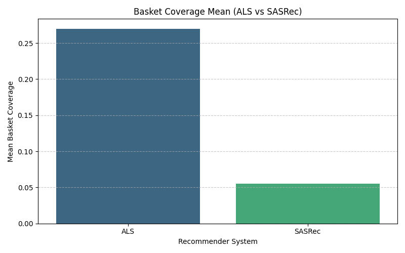

*ALS provided significantly better basket coverage than SASRec.* (Bar Chart)

## Enhanced Visualizations: Distribution of A/B Test Metrics

To provide a deeper understanding of the recommender systems' performance, the following violin plots visualize the *distribution* of the metrics (Hits@10, Revenue from Hits, Basket Coverage). These plots show the probability density of the data at different values, giving a richer view than just the mean.

### ALS vs Popularity-based Baseline Distributions

#### Hits@10 Distribution

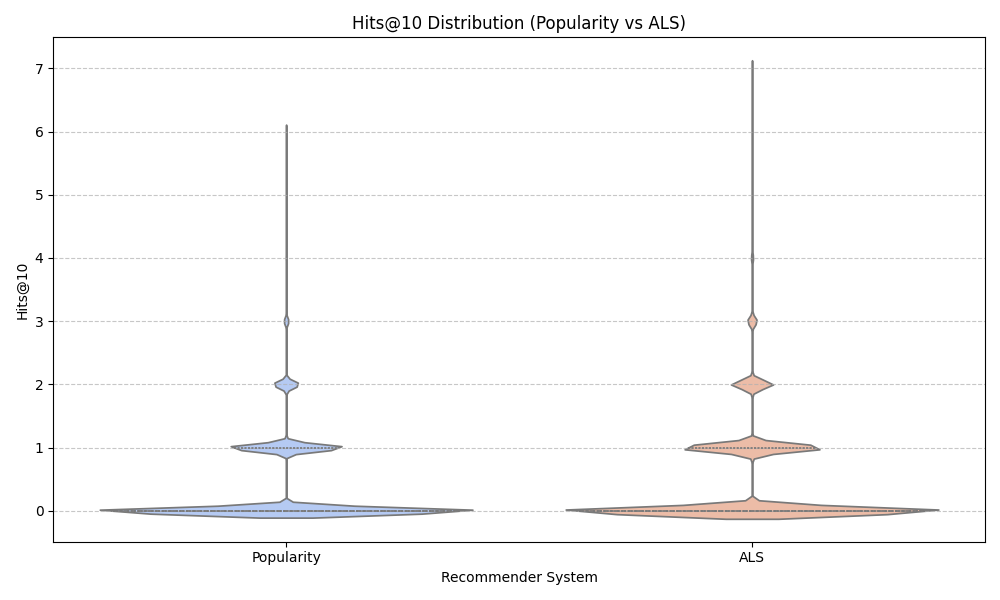

#### Revenue from Hits Distribution

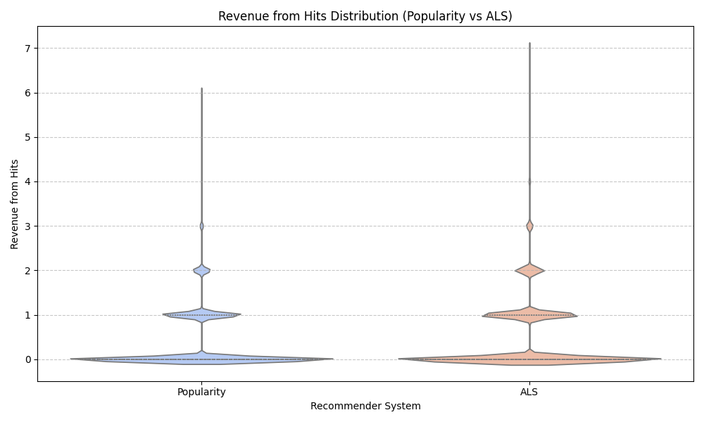

#### Basket Coverage Distribution

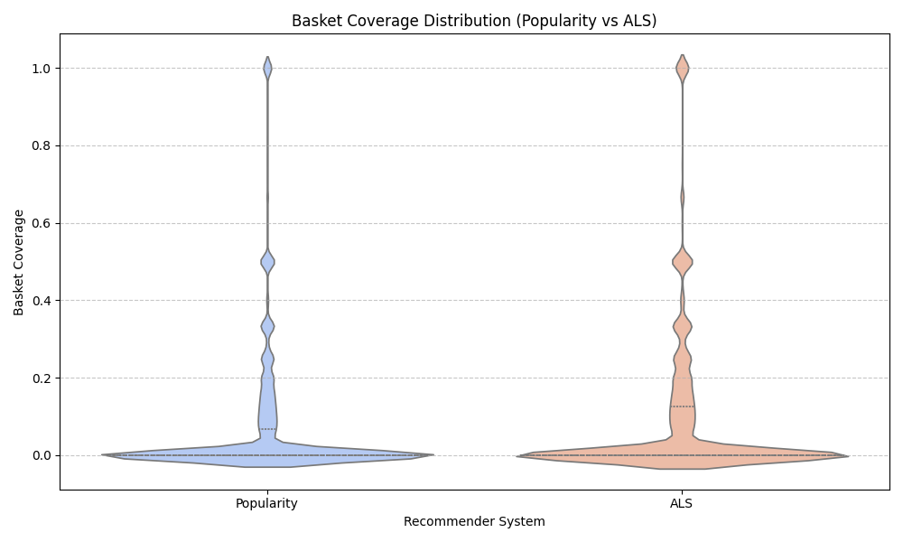

### SASRec vs Popularity-based Baseline Distributions

#### Hits@10 Distribution

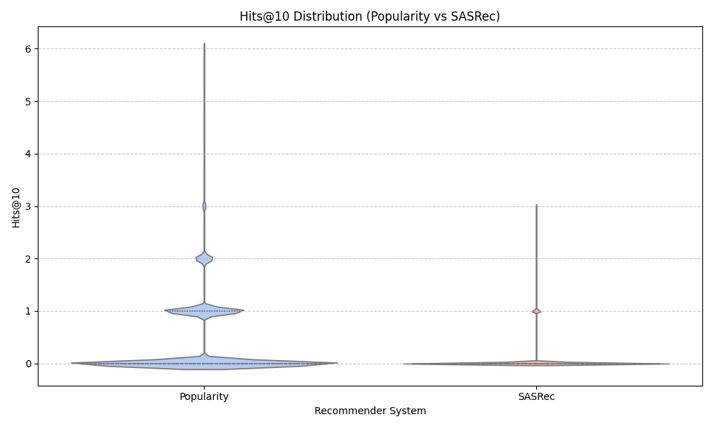

#### Revenue from Hits Distribution

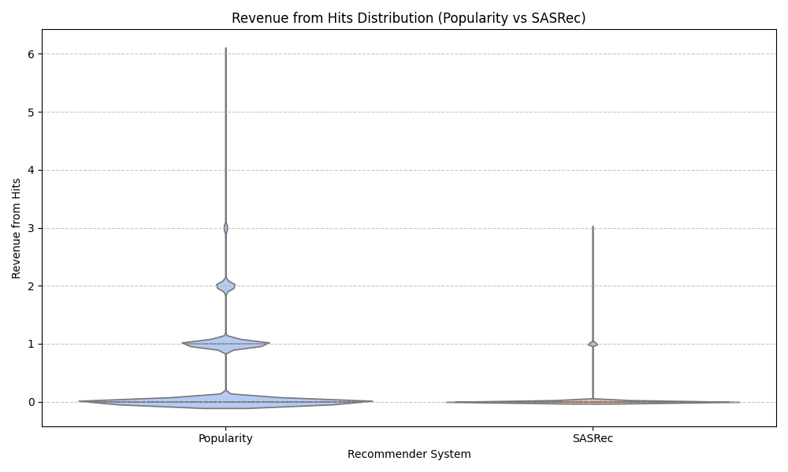

#### Basket Coverage Distribution

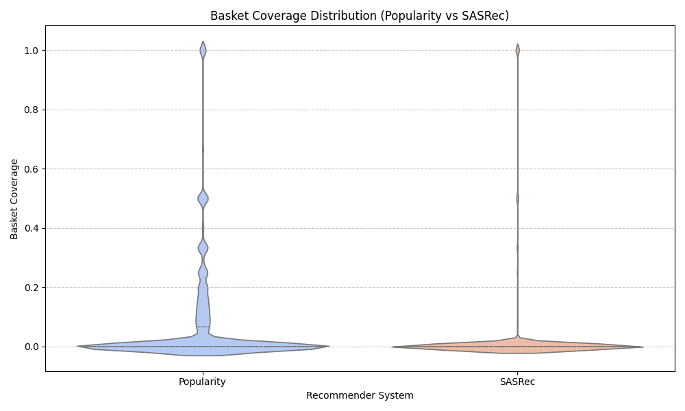

### ALS vs SASRec Distributions

#### Hits@10 Distribution

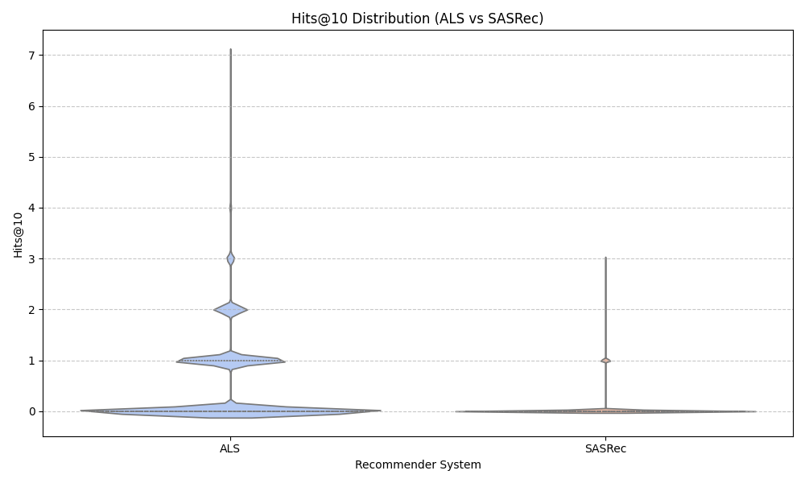

#### Revenue from Hits Distribution

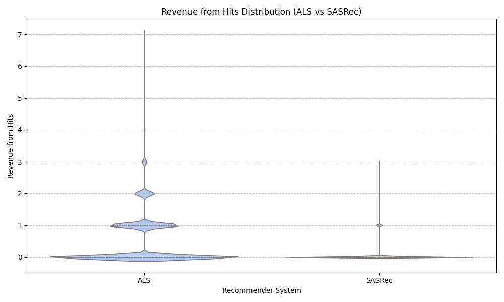

#### Basket Coverage Distribution

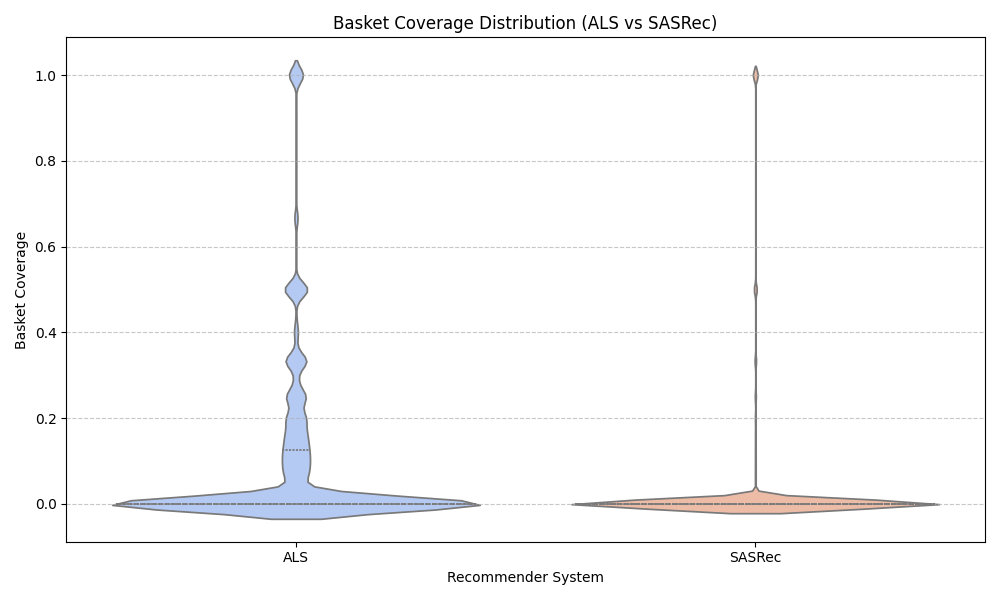

## Overall Consumer Behavior Metrics (Simulated)

These metrics provide a high-level view of customer behavior. In a real-world scenario, these would be directly calculated from granular transaction data. Here, they are simulated for demonstration purposes.

### Churn Metrics

-   **Overall Churn Rate:** 34.62%
-   **Number of Churned Users (Simulated):** 70292
-   *(Based on a simulated 203026 users)*

### Customer Lifetime Value (CLTV) Metrics

-   **Overall Average CLTV:** $654.66
-   **CLTV Standard Deviation:** $211.89
-   *(Based on a simulated 203026 users)*

**Note on Consumer Metrics:** For a true assessment of recommender system impact on churn and CLTV, a long-running A/B test is required where different user groups are exposed to different recommendation strategies, and their subsequent long-term behavior (churn, purchases leading to CLTV) is tracked.
